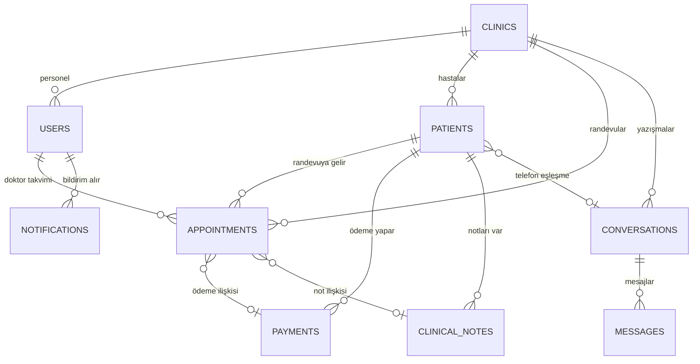
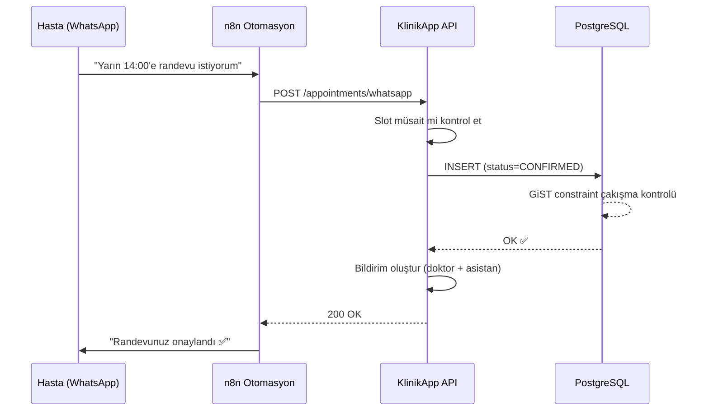
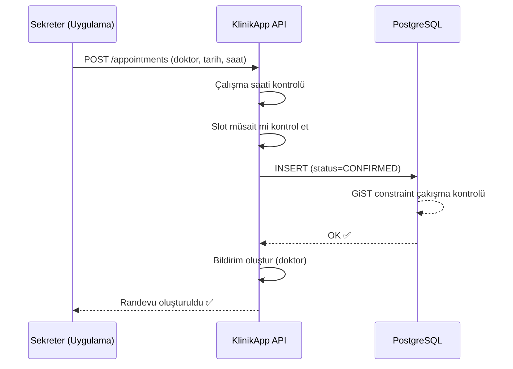

# KlinikApp — Mimari Tasarım Dokümanı (v2)

Multi-tenant, randevu merkezli Klinik Yönetim PWA uygulaması.

---

## 1. Mimari: Modüler Monolit + PWA

### Backend: Modüler Monolit
Her modül kendi domain sınırları içinde çalışır. Modüller arası iletişim event'ler üzerinden. İleride WhatsApp veya Finance modülü bağımsız servise dönüştürülebilir.

### Frontend: PWA (Progressive Web App)
- Tarayıcıda açılır ama masaüstü uygulama gibi hissettirir
- Masaüstüne ikon koyulabilir, ayrı pencerede açılır
- Sol kenar menüsü + sekmeli sayfa yapısı (Adobe benzeri)
- Kurulum / güncelleme derdi yok

### Katman Yapısı (Her Modül)

```
Presentation  → Controller, DTO, Validation
Application   → Use Cases, Event Handlers
Domain        → Entity, Value Object, Domain Events
Infrastructure→ Repository impl, External APIs
```

---

## 2. Tech Stack

### Backend

| Bileşen | Teknoloji | Neden |
|---|---|---|
| Runtime | **Node.js 20 LTS** | Async I/O, webhook'lar için ideal |
| Framework | **NestJS 10** | Modüler yapı, DI, Guard/Interceptor, enterprise-grade |
| Dil | **TypeScript 5.3+** | Tip güvenliği, kolay refactoring |
| ORM | **Prisma 5** | Type-safe query, migration, multi-schema |
| Auth | **JWT (access + refresh)** | Stateless, multi-tenant uyumlu |
| API Docs | **Swagger / OpenAPI 3.0** | Otomatik üretim |
| Realtime | **Socket.IO** | Bildirimler ve mesaj inbox'ı için |
| Job Queue | **BullMQ + Redis** | Zamanlanmış görevler, async webhook |

### Frontend

| Bileşen | Teknoloji | Neden |
|---|---|---|
| Framework | **React 18 + Next.js 14** | PWA desteği, hızlı SPA |
| State | **Zustand** | Basit, performanslı state yönetimi |
| UI Kit | **Shadcn/ui + Tailwind** | Modern, özelleştirilebilir bileşenler |
| Takvim | **FullCalendar** | Profesyonel sürükle-bırak takvim |
| Mesajlaşma | **Socket.IO Client** | Gerçek zamanlı mesaj |
| Dil | **Türkçe** (ileride i18n eklenebilir) | |

### Veritabanı & Altyapı

| Bileşen | Teknoloji | Neden |
|---|---|---|
| DB | **PostgreSQL 16** | ACID, advisory lock, GiST index |
| Cache/Queue | **Redis 7** | BullMQ backend, session cache |
| Tenant izolasyon | **RLS + `clinic_id` FK** | Performans-güvenlik dengesi |
| Container | **Docker + Docker Compose** | Local dev ortamı |
| Logging | **Pino** (structured JSON) | |
| Hosting | **Türkiye/Avrupa sunucu** | KVKK uyumu |

---

## 3. Kullanıcı Rolleri

| Rol | Açıklama | Erişim |
|---|---|---|
| **ADMIN** | Klinik sahibi doktor | Her şeye tam erişim, kullanıcı yönetimi, ayarlar |
| **DOCTOR** | Klinikteki diğer doktorlar | Kendi takvimi, hasta bilgileri, klinik notları |
| **ASSISTANT** | Sekreter / asistan | Tüm takvimlere erişim, mesajlar, hasta kayıt, ödemeler |

> Admin ve asistan tüm doktorların takvimlerini görebilir. Doktor sadece kendi takvimini görür.

---

## 4. Veritabanı Şeması

### 4.1 Klinik & Kullanıcı

```sql
CREATE TABLE clinics (
  id            UUID PRIMARY KEY DEFAULT gen_random_uuid(),
  name          VARCHAR(255) NOT NULL,
  slug          VARCHAR(100) UNIQUE NOT NULL,
  phone         VARCHAR(20),
  address       TEXT,
  timezone      VARCHAR(50) NOT NULL DEFAULT 'Europe/Istanbul',
  settings      JSONB DEFAULT '{}',
  is_active     BOOLEAN NOT NULL DEFAULT true,
  created_at    TIMESTAMPTZ NOT NULL DEFAULT now(),
  updated_at    TIMESTAMPTZ NOT NULL DEFAULT now()
);

CREATE TABLE users (
  id            UUID PRIMARY KEY DEFAULT gen_random_uuid(),
  clinic_id     UUID NOT NULL REFERENCES clinics(id),
  email         VARCHAR(255) NOT NULL,
  password_hash VARCHAR(255) NOT NULL,
  first_name    VARCHAR(100) NOT NULL,
  last_name     VARCHAR(100) NOT NULL,
  phone         VARCHAR(20),
  role          VARCHAR(20) NOT NULL CHECK (role IN ('ADMIN','DOCTOR','ASSISTANT')),
  is_active     BOOLEAN NOT NULL DEFAULT true,
  created_at    TIMESTAMPTZ NOT NULL DEFAULT now(),
  updated_at    TIMESTAMPTZ NOT NULL DEFAULT now(),
  UNIQUE(clinic_id, email)
);

CREATE TABLE refresh_tokens (
  id            UUID PRIMARY KEY DEFAULT gen_random_uuid(),
  user_id       UUID NOT NULL REFERENCES users(id) ON DELETE CASCADE,
  token_hash    VARCHAR(255) NOT NULL,
  expires_at    TIMESTAMPTZ NOT NULL,
  created_at    TIMESTAMPTZ NOT NULL DEFAULT now()
);
```

### 4.2 Hastalar

```sql
CREATE TABLE patients (
  id            UUID PRIMARY KEY DEFAULT gen_random_uuid(),
  clinic_id     UUID NOT NULL REFERENCES clinics(id),
  first_name    VARCHAR(100) NOT NULL,
  last_name     VARCHAR(100) NOT NULL,
  phone         VARCHAR(20) NOT NULL,
  email         VARCHAR(255),
  date_of_birth DATE,
  gender        VARCHAR(10),
  notes         TEXT,
  metadata      JSONB DEFAULT '{}',
  is_active     BOOLEAN NOT NULL DEFAULT true,
  created_at    TIMESTAMPTZ NOT NULL DEFAULT now(),
  updated_at    TIMESTAMPTZ NOT NULL DEFAULT now(),
  UNIQUE(clinic_id, phone)
);

CREATE INDEX idx_patients_search ON patients(clinic_id, last_name, first_name);
CREATE INDEX idx_patients_phone ON patients(clinic_id, phone);

CREATE TABLE patient_attachments (
  id            UUID PRIMARY KEY DEFAULT gen_random_uuid(),
  clinic_id     UUID NOT NULL REFERENCES clinics(id),
  patient_id    UUID NOT NULL REFERENCES patients(id) ON DELETE CASCADE,
  file_name     VARCHAR(255) NOT NULL,
  file_type     VARCHAR(50) NOT NULL,
  file_size     INTEGER NOT NULL,
  storage_key   VARCHAR(500) NOT NULL,
  uploaded_by   UUID NOT NULL REFERENCES users(id),
  created_at    TIMESTAMPTZ NOT NULL DEFAULT now()
);
```

### 4.3 Randevu Sistemi ⭐

```sql
-- Doktor çalışma saatleri
CREATE TABLE doctor_schedules (
  id            UUID PRIMARY KEY DEFAULT gen_random_uuid(),
  clinic_id     UUID NOT NULL REFERENCES clinics(id),
  doctor_id     UUID NOT NULL REFERENCES users(id),
  day_of_week   SMALLINT NOT NULL CHECK (day_of_week BETWEEN 0 AND 6),
  start_time    TIME NOT NULL,
  end_time      TIME NOT NULL,
  break_start   TIME,              -- öğle arası başlangıç
  break_end     TIME,              -- öğle arası bitiş
  slot_duration SMALLINT NOT NULL DEFAULT 30,  -- dakika (sabit ama düzenlenebilir)
  is_active     BOOLEAN NOT NULL DEFAULT true,
  UNIQUE(clinic_id, doctor_id, day_of_week)
);

-- Randevular
CREATE TABLE appointments (
  id            UUID PRIMARY KEY DEFAULT gen_random_uuid(),
  clinic_id     UUID NOT NULL REFERENCES clinics(id),
  doctor_id     UUID NOT NULL REFERENCES users(id),
  patient_id    UUID NOT NULL REFERENCES patients(id),
  start_time    TIMESTAMPTZ NOT NULL,
  end_time      TIMESTAMPTZ NOT NULL,
  duration_min  SMALLINT NOT NULL,
  status        VARCHAR(20) NOT NULL DEFAULT 'CONFIRMED'
                CHECK (status IN ('CONFIRMED','CANCELLED','NO_SHOW','COMPLETED')),
  source        VARCHAR(20) NOT NULL DEFAULT 'MANUAL'
                CHECK (source IN ('MANUAL','WHATSAPP')),  -- nereden geldi
  cancel_reason TEXT,
  notes         TEXT,
  created_by    UUID REFERENCES users(id),  -- NULL = WhatsApp otomasyon
  created_at    TIMESTAMPTZ NOT NULL DEFAULT now(),
  updated_at    TIMESTAMPTZ NOT NULL DEFAULT now(),
  CONSTRAINT chk_time_range CHECK (end_time > start_time)
);

-- DB seviyesinde çakışma engeli (en güvenli yöntem)
CREATE EXTENSION IF NOT EXISTS btree_gist;

ALTER TABLE appointments ADD CONSTRAINT no_overlap
  EXCLUDE USING gist (
    clinic_id WITH =,
    doctor_id WITH =,
    tstzrange(start_time, end_time) WITH &&
  )
  WHERE (status IN ('CONFIRMED'));
```

> [!IMPORTANT]
> WhatsApp'tan gelen randevular zaten boş slotlara alınıyor → direkt **CONFIRMED** olarak kaydedilir. HOLD akışı kaldırıldı, gereksiz karmaşıklık.

### 4.4 WhatsApp Mesajlaşma

```sql
CREATE TABLE conversations (
  id            UUID PRIMARY KEY DEFAULT gen_random_uuid(),
  clinic_id     UUID NOT NULL REFERENCES clinics(id),
  patient_id    UUID REFERENCES patients(id),
  wa_phone      VARCHAR(20) NOT NULL,
  status        VARCHAR(20) NOT NULL DEFAULT 'BOT'
                CHECK (status IN ('BOT','HUMAN','CLOSED')),
  assigned_to   UUID REFERENCES users(id),
  last_message_at TIMESTAMPTZ,
  unread_count  INTEGER NOT NULL DEFAULT 0,
  created_at    TIMESTAMPTZ NOT NULL DEFAULT now(),
  updated_at    TIMESTAMPTZ NOT NULL DEFAULT now(),
  UNIQUE(clinic_id, wa_phone)
);

CREATE TABLE messages (
  id            UUID PRIMARY KEY DEFAULT gen_random_uuid(),
  clinic_id     UUID NOT NULL REFERENCES clinics(id),
  conversation_id UUID NOT NULL REFERENCES conversations(id),
  wa_message_id VARCHAR(255),        -- duplicate engelleme
  direction     VARCHAR(10) NOT NULL CHECK (direction IN ('INBOUND','OUTBOUND')),
  content_type  VARCHAR(20) NOT NULL DEFAULT 'TEXT'
                CHECK (content_type IN ('TEXT','IMAGE','DOCUMENT','AUDIO','VIDEO','TEMPLATE')),
  body          TEXT,
  media_url     VARCHAR(500),
  status        VARCHAR(20) DEFAULT 'SENT'
                CHECK (status IN ('SENT','DELIVERED','READ','FAILED')),
  metadata      JSONB DEFAULT '{}',
  created_at    TIMESTAMPTZ NOT NULL DEFAULT now()
);

CREATE UNIQUE INDEX idx_messages_wa_id
  ON messages(clinic_id, wa_message_id)
  WHERE wa_message_id IS NOT NULL;
```

### 4.5 Finans

```sql
CREATE TABLE payments (
  id            UUID PRIMARY KEY DEFAULT gen_random_uuid(),
  clinic_id     UUID NOT NULL REFERENCES clinics(id),
  patient_id    UUID NOT NULL REFERENCES patients(id),
  appointment_id UUID REFERENCES appointments(id),
  amount        DECIMAL(10,2) NOT NULL,
  currency      VARCHAR(3) NOT NULL DEFAULT 'TRY',
  payment_method VARCHAR(20) NOT NULL
                CHECK (payment_method IN ('CASH','CREDIT_CARD','BANK_TRANSFER','OTHER')),
  payment_type  VARCHAR(20) NOT NULL DEFAULT 'PAYMENT'
                CHECK (payment_type IN ('PAYMENT','REFUND')),
  description   TEXT,
  paid_at       TIMESTAMPTZ NOT NULL DEFAULT now(),
  created_by    UUID NOT NULL REFERENCES users(id),
  created_at    TIMESTAMPTZ NOT NULL DEFAULT now()
);

CREATE VIEW patient_balances AS
SELECT clinic_id, patient_id,
  SUM(CASE WHEN payment_type = 'PAYMENT' THEN amount ELSE -amount END) AS total_paid
FROM payments GROUP BY clinic_id, patient_id;
```

### 4.6 Klinik Notu

```sql
CREATE TABLE clinical_notes (
  id            UUID PRIMARY KEY DEFAULT gen_random_uuid(),
  clinic_id     UUID NOT NULL REFERENCES clinics(id),
  patient_id    UUID NOT NULL REFERENCES patients(id),
  appointment_id UUID REFERENCES appointments(id),
  doctor_id     UUID NOT NULL REFERENCES users(id),
  note_type     VARCHAR(20) NOT NULL DEFAULT 'NOTE'
                CHECK (note_type IN ('NOTE','PRESCRIPTION','DIAGNOSIS')),
  title         VARCHAR(255),
  content       TEXT NOT NULL,
  visibility    VARCHAR(20) NOT NULL DEFAULT 'DOCTOR_ONLY'
                CHECK (visibility IN ('DOCTOR_ONLY','STAFF','ALL')),
  created_at    TIMESTAMPTZ NOT NULL DEFAULT now(),
  updated_at    TIMESTAMPTZ NOT NULL DEFAULT now()
);
```

### 4.7 Bildirimler & Audit Log

```sql
-- Uygulama içi bildirimler
CREATE TABLE notifications (
  id            UUID PRIMARY KEY DEFAULT gen_random_uuid(),
  clinic_id     UUID NOT NULL REFERENCES clinics(id),
  user_id       UUID NOT NULL REFERENCES users(id),  -- kime gidecek
  type          VARCHAR(30) NOT NULL,   -- NEW_APPOINTMENT, NEW_MESSAGE, etc.
  title         VARCHAR(255) NOT NULL,
  body          TEXT,
  entity_type   VARCHAR(50),            -- appointment, message, etc.
  entity_id     UUID,
  is_read       BOOLEAN NOT NULL DEFAULT false,
  created_at    TIMESTAMPTZ NOT NULL DEFAULT now()
);

CREATE INDEX idx_notifications_user ON notifications(user_id, is_read, created_at DESC);

-- Audit log
CREATE TABLE audit_logs (
  id            UUID PRIMARY KEY DEFAULT gen_random_uuid(),
  clinic_id     UUID NOT NULL REFERENCES clinics(id),
  user_id       UUID REFERENCES users(id),
  action        VARCHAR(50) NOT NULL,
  entity_type   VARCHAR(50) NOT NULL,
  entity_id     UUID,
  old_values    JSONB,
  new_values    JSONB,
  ip_address    VARCHAR(45),
  created_at    TIMESTAMPTZ NOT NULL DEFAULT now()
);
```

### ER Diyagramı



---

## 5. Modül Yapısı

```
klinikapp/
├── backend/
│   └── src/
│       ├── common/         # Guard, Interceptor, Decorator, Filter
│       │   ├── guards/     (jwt, roles, tenant)
│       │   ├── interceptors/ (audit-log, tenant-context)
│       │   └── decorators/ (roles, current-user, current-tenant)
│       │
│       ├── modules/
│       │   ├── auth/       # Giriş, JWT, refresh token
│       │   ├── tenant/     # Klinik yönetimi, ayarlar
│       │   ├── user/       # Kullanıcı CRUD (ADMIN, DOCTOR, ASSISTANT)
│       │   ├── patient/    # Hasta CRUD, arama, dosya ekleri
│       │   ├── appointment/# Takvim, randevu, çakışma kontrolü ⭐
│       │   ├── messaging/  # WhatsApp mesajlar, inbox, Socket.IO
│       │   ├── finance/    # Ödeme kayıt, bakiye
│       │   ├── clinical-note/ # Doktor notu, reçete
│       │   ├── notification/  # Uygulama içi bildirimler
│       │   └── audit/      # Denetim kaydı
│       │
│       └── prisma/         # Schema, migration, seed
│
├── frontend/
│   └── src/
│       ├── app/            # Next.js sayfa routing
│       │   ├── dashboard/  # Ana sayfa (günün özeti)
│       │   ├── calendar/   # Takvim görünümü (FullCalendar)
│       │   ├── messages/   # WhatsApp inbox
│       │   ├── patients/   # Hasta listesi & detay
│       │   ├── finance/    # Ödeme kayıtları
│       │   └── settings/   # Klinik ayarları (ADMIN)
│       │
│       ├── components/     # Paylaşılan UI bileşenleri
│       │   ├── layout/     (sidebar, header, tabs)
│       │   ├── calendar/   (takvim bileşenleri)
│       │   ├── messaging/  (mesaj baloncukları, inbox)
│       │   └── common/     (butonlar, formlar, tablolar)
│       │
│       └── lib/            # API client, auth, utils
│
└── docker-compose.yml      # PostgreSQL + Redis + App
```

---

## 6. API Endpoint Listesi

Tüm endpoint'ler `/api/v1` altında. `clinic_id` JWT'den otomatik alınır.

### Auth
| Method | Endpoint | Açıklama | Erişim |
|---|---|---|---|
| POST | `/auth/register` | Klinik + Admin kaydı | Public |
| POST | `/auth/login` | Giriş | Public |
| POST | `/auth/refresh` | Token yenile | Auth |
| POST | `/auth/logout` | Çıkış | Auth |
| GET | `/auth/me` | Mevcut kullanıcı | Auth |

### Klinik
| Method | Endpoint | Açıklama | Erişim |
|---|---|---|---|
| GET | `/clinic` | Klinik bilgisi | Auth |
| PATCH | `/clinic` | Klinik güncelle | ADMIN |

### Kullanıcılar
| Method | Endpoint | Açıklama | Erişim |
|---|---|---|---|
| GET | `/users` | Listele | ADMIN |
| POST | `/users` | Ekle | ADMIN |
| PATCH | `/users/:id` | Güncelle | ADMIN |
| DELETE | `/users/:id` | Deaktif et | ADMIN |

### Hastalar
| Method | Endpoint | Açıklama | Erişim |
|---|---|---|---|
| GET | `/patients` | Listele & ara | ADMIN, DOCTOR, ASSISTANT |
| POST | `/patients` | Ekle | ADMIN, ASSISTANT |
| GET | `/patients/:id` | Detay (geçmiş dahil) | ADMIN, DOCTOR, ASSISTANT |
| PATCH | `/patients/:id` | Güncelle | ADMIN, ASSISTANT |
| POST | `/patients/:id/attachments` | Dosya yükle | ADMIN, DOCTOR, ASSISTANT |
| POST | `/patients/import` | Excel'den toplu yükleme | ADMIN |

### Randevular ⭐
| Method | Endpoint | Açıklama | Erişim |
|---|---|---|---|
| GET | `/appointments` | Listele (tarih, doktor filtresi) | ALL |
| POST | `/appointments` | Manuel randevu oluştur | ADMIN, ASSISTANT |
| POST | `/appointments/whatsapp` | n8n'den gelen randevu | API Key |
| GET | `/appointments/:id` | Detay | ALL |
| PATCH | `/appointments/:id` | Düzenle (saat, süre) | ADMIN, ASSISTANT |
| PATCH | `/appointments/:id/cancel` | İptal | ADMIN, DOCTOR, ASSISTANT |
| PATCH | `/appointments/:id/no-show` | Gelmedi | ADMIN, DOCTOR |
| PATCH | `/appointments/:id/complete` | Tamamlandı | ADMIN, DOCTOR |
| GET | `/appointments/available-slots` | Müsait slotlar | ALL |
| GET | `/doctors/:id/schedule` | Çalışma saatleri | ALL |
| PUT | `/doctors/:id/schedule` | Çalışma saati güncelle | ADMIN, DOCTOR(kendi) |

### Mesajlaşma
| Method | Endpoint | Açıklama | Erişim |
|---|---|---|---|
| POST | `/webhooks/whatsapp` | Meta webhook | Public (verify) |
| GET | `/conversations` | Inbox | ADMIN, ASSISTANT |
| GET | `/conversations/:id` | Mesajlar | ADMIN, ASSISTANT |
| POST | `/conversations/:id/messages` | Cevap yaz | ADMIN, ASSISTANT |
| PATCH | `/conversations/:id/mode` | BOT↔HUMAN | ADMIN, ASSISTANT |

### Finans
| Method | Endpoint | Açıklama | Erişim |
|---|---|---|---|
| GET | `/payments` | Listele | ADMIN |
| POST | `/payments` | Kaydet | ADMIN, ASSISTANT |
| GET | `/patients/:id/balance` | Hasta bakiye | ADMIN |
| GET | `/payments/summary` | Ciro özeti | ADMIN |

### Klinik Notları
| Method | Endpoint | Açıklama | Erişim |
|---|---|---|---|
| GET | `/clinical-notes` | Listele | ADMIN, DOCTOR |
| POST | `/clinical-notes` | Oluştur | DOCTOR |
| PATCH | `/clinical-notes/:id` | Güncelle | DOCTOR(kendi) |

### Bildirimler
| Method | Endpoint | Açıklama | Erişim |
|---|---|---|---|
| GET | `/notifications` | Bildirimleri getir | Auth |
| PATCH | `/notifications/:id/read` | Okundu işaretle | Auth |
| PATCH | `/notifications/read-all` | Tümünü okundu | Auth |

### Dashboard
| Method | Endpoint | Açıklama | Erişim |
|---|---|---|---|
| GET | `/dashboard` | Günün özeti | Auth |

---

## 7. Randevu Çakışma Algoritması

### Akış: WhatsApp'tan Randevu



### Akış: Manuel Randevu



### 3 Katmanlı Savunma

| Katman | Ne Yapar | Neden Lazım |
|---|---|---|
| **1. Application check** | INSERT'ten önce müsaitlik kontrolü | Kullanıcıya anlamlı hata mesajı |
| **2. Advisory lock** | Aynı doktor+gün için istekleri sıraya koyar | İki kişi aynı anda tıklarsa race condition engeli |
| **3. DB constraint** | `EXCLUDE USING gist` — overlap kesinlikle engellenir | Son savunma hattı, hiçbir şekilde delinemez |

---

## 8. n8n Entegrasyonu

### Mevcut Durum → Hedef

```
ŞİMDİ:  WhatsApp → n8n → Google Sheets + Google Takvim
HEDEF:   WhatsApp → n8n → KlinikApp API → PostgreSQL
```

### n8n'de Yapılacak Değişiklik
- Google Sheets node'u → **HTTP Request node'u** (KlinikApp API'ye istek)
- API Key ile güvenli bağlantı
- Mevcut akış mantığı aynı kalır, sadece hedef değişir

### Webhook Entegrasyonu
- n8n, WhatsApp'tan gelen mesajları KlinikApp'a bildirir
- KlinikApp mesajı kaydeder + Socket.IO ile inbox'ı canlı günceller
- Duplicate mesaj engelleme: `wa_message_id` unique index

---

## 9. Sprint Planı

### Sprint 0 — Altyapı (1 hafta)
- Proje scaffolding (NestJS + Next.js + Prisma + Docker)
- PostgreSQL, Redis container'ları
- Migration + Seed
- Swagger, Logger, Global filters

### Sprint 1 — Auth & Tenant (1.5 hafta)
- JWT auth (access + refresh)
- Klinik kaydı + Admin kullanıcı
- Kullanıcı CRUD (ADMIN, DOCTOR, ASSISTANT)
- Tenant context guard (her istekte clinic_id kontrolü)
- Rol bazlı erişim
- Audit log interceptor
- Frontend: Login sayfası + Layout (sidebar, header)

### Sprint 2 — Hasta Yönetimi (1 hafta)
- Hasta CRUD + arama
- Excel import
- Dosya ek metadata
- Frontend: Hasta listesi + detay sayfası

### Sprint 3 — Randevu Sistemi (2 hafta) ⭐
- Doktor çalışma saatleri
- Müsait slot hesaplama
- Randevu oluşturma + çakışma kontrolü (3 katman)
- n8n API endpoint'i
- İptal, no-show, complete
- Bildirim oluşturma
- Frontend: FullCalendar takvim + randevu formu

### Sprint 4 — Mesajlaşma (1.5 hafta)
- Webhook endpoint + idempotency
- Konuşma yönetimi
- Uygulama içinden cevap yazma (WhatsApp Business API)
- Socket.IO gateway (canlı mesaj)
- Frontend: Inbox + mesaj ekranı (WhatsApp benzeri)

### Sprint 5 — Finans, Notlar, Dashboard (1 hafta)
- Ödeme CRUD + bakiye
- Klinik notu CRUD
- Dashboard (günün özeti)
- Frontend: Ödeme sayfası + not sayfası + dashboard

### Sprint 6 — Polish & Test (1 hafta)
- E2E test senaryoları
- Concurrency testi (randevu)
- Seed data (demo klinik)
- PWA manifest + offline shell
- README + kurulum dokümantasyonu

**Toplam: ~8-9 hafta**

---

## 10. Risk Analizi

| Risk | Etki | Azaltma |
|---|---|---|
| **Randevu çakışması** | 🔴 Kritik | 3 katmanlı savunma (app + lock + DB constraint) |
| **Tenant veri sızıntısı** | 🔴 Kritik | Tenant guard + RLS + integration test |
| **Webhook duplicate** | 🟡 Orta | `wa_message_id` unique index |
| **WhatsApp API değişikliği** | 🟡 Orta | Abstraction layer, n8n akışı bağımsız |
| **KVKK ihlali** | 🔴 Kritik | TR/EU sunucu, şifreleme, audit log, hukuki danışmanlık |
| **n8n geçiş sorunları** | 🟡 Orta | Eski+yeni sistem paralel çalışır, kademeli geçiş |
| **Timezone hataları** | 🟡 Orta | Tüm tarihler UTC, display'de timezone dönüşümü |

---

## Verification Plan

### Otomatik Testler
- Her modül için unit test (Jest)
- Randevu çakışma concurrency testi (paralel istekler)
- Tenant izolasyon testi (cross-tenant erişim engeli)
- Webhook idempotency testi

### Manuel Doğrulama
- Docker Compose ile local ortam
- Swagger UI'dan tüm endpoint test
- Seed data ile demo akış: kayıt → giriş → hasta → randevu → mesaj → ödeme
- n8n entegrasyon testi (test webhook)
