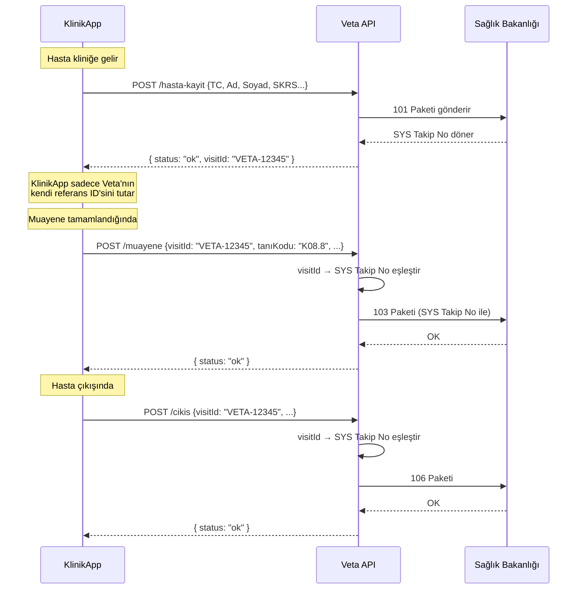
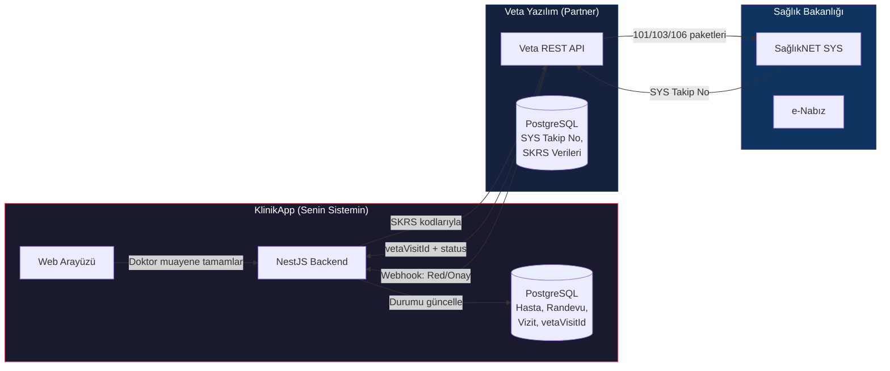

# 🏥 KlinikApp × Veta Yazılım — E-Nabız Entegrasyon Mimari Analizi

> **Partner:** Veta Bilgisayar ve Yazılım Hizm. San. ve Tic. Ltd. Şti.
> **Durum:** Sağlık Bakanlığı KTS (Kayıt ve Tescil Sistemi) onaylı, 56 firmadan biri
> **Tarih:** 16 Mayıs 2026

---

## 1. Temel Kısıt: "SYS Takip No Senin DB'inde Olmayacak"

Veta'nın söylediği şey çok mantıklı ve Sağlık Bakanlığı'nın yaklaşımıyla uyumlu:

> [!IMPORTANT]
> **Bakanlık Kuralı:** SYS Takip Numarası ve benzeri Bakanlık tarafından üretilen referans verileri, yalnızca **KTS onaylı sistemlerde** saklanabilir. KlinikApp onaylı bir HBYS/MBYS olmadığı için bu verileri kendi veritabanında saklamamalı.

Bu kısıt seni aslında **koruyor** — çünkü bu veriyi saklarsan hem KVKK hem de Bakanlık denetimine tabi olursun.

---

## 2. Asıl Soru: SYS Takip No'yu Saklamadan Nasıl Kullanırım?

Bu senin en kritik sorunun. İşte **3 olası çözüm modeli:**

### Model A: "Sorgula & Kullan" (Önerilen ✅)



**Nasıl çalışır:**
1. KlinikApp, 101 (Hasta Kayıt) için Veta'ya istek atar
2. Veta, Bakanlık'a gönderir, SYS Takip No'yu **kendi DB'sinde saklar**
3. Veta, KlinikApp'e **kendi iç referans ID'sini** (`visitId`) döner
4. KlinikApp bu `visitId`'yi saklar (bu Bakanlık verisi değil, Veta'nın kendi ID'si)
5. Sonraki paketlerde (103, 106) KlinikApp `visitId`'yi gönderir
6. Veta, kendi DB'sinde `visitId → SYS Takip No` eşleştirmesini yapıp Bakanlığa iletir

> [!TIP]
> **Neden bu model en iyi?** Çünkü Bakanlık verisine hiç dokunmuyorsun. Veta'nın döndüğü `visitId` onların kendi iç referansı — bu bir "Bakanlık tarafından üretilen bit" değil.

### Model B: "Geçici Bellekte Tut" (Riskli ⚠️)

SYS Takip No'yu API response'unda alıp, sadece o oturum boyunca RAM'de tutmak ve hiçbir yere persist etmemek. **Ama** uygulama restart'ında kaybolur, multi-server durumlarında sorun çıkar. **Önerilmez.**

### Model C: "Her Seferinde Sorgula" (Yavaş 🐌)

Her 103/106 göndermeden önce Veta'ya "Bu TC + bu tarih için SYS Takip No nedir?" diye sormak. Gereksiz trafik yaratır ve Veta tarafında ek endpoint gerektirir. **Gerekmedikçe önerilmez.**

---

## 3. Önerilen API Mimarisi (İki Taraflı, Senkron)

### KlinikApp → Veta (Giden API Çağrıları)

| Endpoint | Tetikleyici | Gönderilen Veri | Dönen Veri |
|----------|-------------|-----------------|------------|
| `POST /api/hasta-kayit` | Hasta kliniğe geldiğinde | TC, Ad, Soyad, Doğum Tarihi, Cinsiyet, Branş (SKRS kodu) | `{ visitId, status }` |
| `POST /api/muayene` | Muayene tamamlandığında | `visitId`, ICD-10 Tanı Kodu, Tedavi, Uzman Bilgisi | `{ status }` |
| `POST /api/hizmet` | İşlem yapıldığında | `visitId`, İşlem SKRS Kodu, Miktar | `{ status }` |
| `POST /api/cikis` | Hasta çıkışında | `visitId`, Çıkış Durumu (SKRS), Sevk Bilgisi | `{ status }` |
| `GET /api/takip-durum/:visitId` | Durum kontrolü | - | `{ visitId, 101: "OK", 103: "PENDING", 106: "NOT_SENT" }` |

### Veta → KlinikApp (Gelen Webhook/Callback)

| Endpoint | Ne Zaman Tetiklenir | Gelen Veri |
|----------|---------------------|------------|
| `POST /webhook/enabiz-durum` | Bakanlık red/onay döndüğünde | `{ visitId, paketTipi, durum, hataMesaji? }` |
| `POST /webhook/enabiz-uyari` | SKRS kodu hatalı olduğunda | `{ visitId, alan, beklenen, gonderilen }` |

> [!WARNING]
> **Senkron ama Dayanıklı Olmalı:** API senkron çalışsa bile, Veta'nın Bakanlık'a göndermesi birkaç saniye sürebilir. KlinikApp tarafında **timeout + retry** mekanizması şart. Ayrıca Veta'nın yanıt vermediği durumlar için bir **"Beklemede"** durumu UI'da gösterilmeli.

---

## 4. SKRS Kodları: Ne Göndereceksin?

KlinikApp'in Veta'ya göndereceği tüm veriler SKRS standardında olmalı. İşte ihtiyacın olan ana kodlama sistemleri:

| Kodlama Sistemi | Ne İçin | Kaynak | Örnek |
|-----------------|---------|--------|-------|
| **ICD-10** | Tanı kodları | `skrs.saglik.gov.tr` | `K08.8` (Diş hastalıkları) |
| **SUT İşlem Kodları** | Yapılan işlemler | SUT Eki-2 listesi | `401.010` (Diş çekimi) |
| **SKRS Branş Kodları** | Klinik branşı | SKRS tabloları | `2200` (Diş Hekimliği) |
| **SKRS Cinsiyet** | Hasta cinsiyeti | SKRS tabloları | `1` (Erkek), `2` (Kadın) |
| **SKRS Çıkış Durumu** | Taburcu şekli | SKRS tabloları | `1` (Şifa), `6` (Sevk) |

> [!NOTE]
> **Kim Dönüştürür?** Veta ile konuşmanız gereken en kritik nokta bu. KlinikApp UI'da doktor "Diş ağrısı" yazıyorsa, bunu ICD-10 `K08.8`'e kim çevirecek?
> - **Seçenek A:** KlinikApp'e ICD-10 autocomplete ekle, doktor direkt kodu seçsin
> - **Seçenek B:** Veta metin-to-SKRS dönüşüm API'ı sağlasın
> - **Önerimiz:** **Seçenek A** — doktor direkt SKRS kodunu seçsin. Bu hem daha hızlı hem de hata payını minimize eder.

---

## 5. KlinikApp Mevcut Veri Yapısı ve Gerekli Değişiklikler

Mevcut KlinikApp koduna baktığımda:

### Mevcut Durum
- ✅ **Hasta modeli**: TC Kimlik şifreli (AES) + hash ile saklanıyor — KVKK uyumlu
- ✅ **Randevu sistemi**: Doktor-hasta-zaman ilişkisi var
- ❌ **Vizit (Ziyaret) kavramı yok**: Hastanın kliniğe gelişi ayrı bir entity olarak takip edilmiyor
- ❌ **SKRS kod sistemi yok**: Tanı/işlem kodları henüz sistemde değil
- ❌ **E-Nabız entegrasyon katmanı yok**

### Yapılması Gerekenler

```
KlinikApp DB'ye eklenecek:
├── Visit (Ziyaret) tablosu
│   ├── id (kendi ID'miz)
│   ├── patientId → Patient
│   ├── appointmentId → Appointment
│   ├── doctorId → Doctor
│   ├── vetaVisitId (Veta'nın döndüğü referans)
│   ├── enabizStatus: PENDING | SENT_101 | SENT_103 | SENT_106 | COMPLETED | ERROR
│   ├── enabizErrorMessage?
│   ├── checkInTime, checkOutTime
│   └── diagnoses: [{icd10Code, description}]
│
├── EnabizLog tablosu (her API çağrısının logu)
│   ├── visitId
│   ├── direction: OUTGOING | INCOMING
│   ├── endpoint
│   ├── requestBody (anonymized)
│   ├── responseStatus
│   └── timestamp
│
└── SkrsCode tablosu (ICD-10, İşlem kodları cache)
    ├── code, description, category
    └── isActive
```

---

## 6. Veta'ya Sorman Gereken Kritik Sorular

### 🔴 Zorunlu (Sunum Öncesi Netleşmeli)

| # | Soru | Neden Önemli |
|---|------|-------------|
| 1 | **API formatınız REST mi, SOAP mı, FHIR mı?** | KlinikApp backend'i NestJS (TypeScript) — REST ve FHIR rahat entegre olur, SOAP için ek kütüphane gerekir |
| 2 | **Bize döneceğiniz referans ID (visitId) yapısı ne olacak?** | Bu ID'yi kendi DB'mizde saklayacağız, SYS Takip No'yu değil |
| 3 | **Authentication nasıl olacak?** API Key, OAuth2, mTLS? | Güvenlik mimarisinin temeli |
| 4 | **Sandbox/test ortamınız var mı?** | Geliştirme sırasında gerçek veri göndermeden test edebilmemiz şart |
| 5 | **SKRS kodlarını biz mi göndereceğiz yoksa siz metin dönüşümü yapıyor musunuz?** | UI tasarımını etkiler |
| 6 | **Bakanlık red durumunda webhook/callback mekanizmanız var mı?** | Hata yönetimi stratejisi |

### 🟡 Önemli (Geliştirme Başlangıcında Netleşmeli)

| # | Soru | Neden Önemli |
|---|------|-------------|
| 7 | **Rate limit var mı? Aynı anda kaç istek atabiliriz?** | Yoğun klinik saatlerinde sorun olabilir |
| 8 | **Bir hastanın aynı gün içinde 2. ziyaretinde yeni 101 mi gerekiyor?** | Vizit akışı mantığı |
| 9 | **API yanıt süresi garantiniz var mı? (SLA)** | UI'da hasta bekletme süresi |
| 10 | **Hata kodlarınız ve anlamları dökümante mı?** | Error handling |
| 11 | **Gelir modeli: İşlem başı mı, aylık sabit mi, lisans mı?** | İş planı |

### 🟢 Nice-to-Have

| # | Soru |
|---|------|
| 12 | Toplu (batch) veri gönderimi destekliyor musunuz? |
| 13 | API versiyonlama politikanız nedir? |
| 14 | Mevcut HBYS müşterilerinizle benzer bir entegrasyon yaptınız mı? |

---

## 7. Sunum İçin "Elevator Pitch"

Veta'ya sunumda şunu anlatman gerekiyor:

> **KlinikApp**, küçük/orta ölçekli özel klinikler (özellikle diş klinikleri) için geliştirilen, WhatsApp AI asistanı entegreli modern bir klinik yönetim sistemidir. Hasta kayıtları şifreli (AES-256) saklanır, KVKK uyumludur. Ancak **KTS onayımız yoktur ve almayı planlamıyoruz** — bunun yerine Veta Yazılım gibi onaylı bir partner ile çalışarak e-Nabız bildirimlerini yapmak istiyoruz. Bizim 50+ klinik müşteri potansiyelimiz var, her yeni klinik = Veta için yeni bir gelir kaynağı.

---

## 8. Özet: Veri Akış Diyagramı



> [!CAUTION]
> **Asla yapmamanız gereken:** SYS Takip No'yu, Bakanlık sertifikalarını veya Bakanlık tarafından üretilen herhangi bir referans verisini KlinikApp veritabanında saklamak. Bu, hem yasal sorumluluk hem de Bakanlık denetimi açısından ciddi risk oluşturur.
