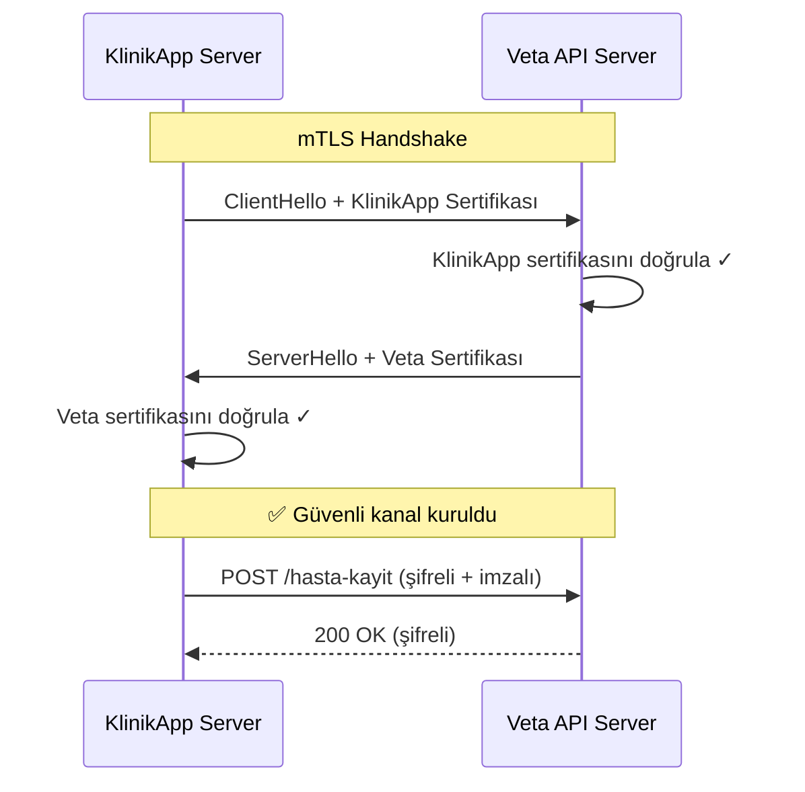
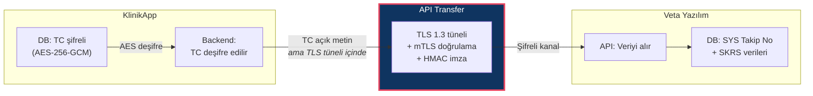

# 🔒 KlinikApp × Veta Yazılım — Veri Güvenliği & KVKK Uyumluluk Planı

> **Amaç:** Veta Yazılım'ın hukuki endişelerini gidermek ve "bu adamlarla çalışsak güvende miyiz?" sorusuna somut teknik kanıtlarla cevap vermek.

---

## 1. Veta'nın Endişesi Ne?

Veta'nın KTS onaylı bir firma olarak en büyük korkusu şu:

> *"KlinikApp güvenli mi? Ben senin verini alırken bir hata olursa, Bakanlık benim KTS onayımı iptal eder."*

Bu çok haklı bir endişe. Bakanlık denetimlerinde **"verinin nereden geldiği"** de sorgulanıyor. Yani Veta sadece kendi güvenliğinden değil, **veri kaynağının (yani senin) güvenliğinden de** sorumlu tutulabilir.

Senin yapman gereken: **"Ben güvenli bir kaynağım"** demek değil, **bunu kanıtlamak**.

---

## 2. KlinikApp'in Mevcut Güvenlik Durumu (Elinde Ne Var?)

KlinikApp kodunu inceledim. Zaten güçlü bir temelin var:

### ✅ Var Olan Güvenlik Önlemleri

| Katman | Teknoloji | Detay |
|--------|-----------|-------|
| **Veri Şifreleme (At Rest)** | AES-256-GCM + PBKDF2 | TC Kimlik ve mesajlar şifreli saklanıyor. Her kayıt için random salt + IV |
| **Hashing** | SHA-256 | TC Kimlik aramaları için geri döndürülemez hash |
| **Authentication** | JWT (Bearer Token) | Tüm controller'lar `AuthGuard('jwt')` ile korunuyor |
| **Authorization** | Role-Based (RBAC) | `RolesGuard` ile DOCTOR, ASSISTANT, ADMIN rolleri |
| **Webhook Güvenliği** | Custom Guard | `N8nWebhookGuard` ile dış webhook istekleri doğrulanıyor |
| **API Docs** | Swagger + ApiBearerAuth | Tüm endpoint'ler dokümante |
| **Multi-tenant** | clinicId isolation | Her sorgu `clinicId` ile sınırlı |

### ❌ Eksik Olan (Veta Entegrasyonu İçin Eklenmesi Gereken)

| Eksik | Risk Seviyesi | Açıklama |
|-------|---------------|----------|
| **Transit Encryption (mTLS)** | 🔴 Kritik | API çağrıları sırasında iki taraflı sertifika doğrulaması yok |
| **API İmzalama (HMAC)** | 🔴 Kritik | Gönderilen verinin bütünlüğü ve kaynağı doğrulanamıyor |
| **Audit Log** | 🟡 Yüksek | Kimin hangi veriye ne zaman eriştiğinin denetim logu yok |
| **Veri İşleyen Sözleşmesi** | 🔴 Kritik | KVKK md.12 gereği zorunlu |
| **Rate Limiting** | 🟡 Yüksek | API'ya brute-force koruması yok |
| **IP Whitelist** | 🟡 Yüksek | Veta API'ına sadece KlinikApp IP'sinden erişim kısıtı |

---

## 3. Güvenlik Mimarisi: Veta'yı İkna Edecek 5 Katman

Veta'ya sunumda şunu göstermelisin: **"Biz 5 katmanlı güvenlik uyguluyoruz"**

```
┌─────────────────────────────────────────────────────┐
│                    KATMAN 5                          │
│              📋 KVKK Sözleşme & Denetim             │
│     Veri İşleyen Sözleşmesi + Düzenli Denetim       │
├─────────────────────────────────────────────────────┤
│                    KATMAN 4                          │
│              📝 Audit Trail (Denetim İzi)            │
│   Her API çağrısı: Kim, Ne, Ne Zaman loglanır       │
├─────────────────────────────────────────────────────┤
│                    KATMAN 3                          │
│              ✍️ HMAC İmzalama                        │
│   Her istek dijital imzalı → veri bütünlüğü garanti │
├─────────────────────────────────────────────────────┤
│                    KATMAN 2                          │
│              🔐 mTLS (Mutual TLS)                   │
│   İki taraflı sertifika → sadece KlinikApp bağlanır │
├─────────────────────────────────────────────────────┤
│                    KATMAN 1                          │
│              🔑 TLS 1.3 + AES-256-GCM               │
│   Transit'te ve at-rest'te şifreleme                │
└─────────────────────────────────────────────────────┘
```

### Katman 1: TLS 1.3 — Transit Şifreleme (Zaten Standart)
Tüm API iletişimi HTTPS üzerinden TLS 1.3 ile yapılır. Veriler kabloda şifreli akar.
- **Veta'ya mesaj:** *"API endpointleriniz HTTPS olduğu sürece transit'te AES-256-GCM ile şifreli."*

### Katman 2: mTLS — İki Taraflı Sertifika Doğrulama



> [!IMPORTANT]
> **Neden mTLS?** Normal TLS'de sadece sunucu (Veta) kendini kanıtlar. mTLS'de istemci (KlinikApp) de sertifikasıyla kendini kanıtlar. Yani **başka biri senin API key'ini çalsa bile** Veta'ya bağlanamaz — çünkü KlinikApp'in özel sertifikası gerekir.

**Veta'ya mesaj:** *"Biz mTLS kullanacağız. Sizin tarafınızda sadece bizim sertifikamızı whitelist'e almanız yeterli. Başka hiçbir sistem sizin API'ınıza erişemez."*

### Katman 3: HMAC İmzalama — Veri Bütünlüğü

Her API isteğinde gönderilen verinin üzerine dijital imza basılır:

```
Request:
POST /api/hasta-kayit
Headers:
  X-Timestamp: 2026-05-16T10:30:00Z
  X-Nonce: a1b2c3d4e5f6
  X-Signature: HMAC-SHA256(secretKey, timestamp + nonce + body)
Body:
  { "tc": "***", "ad": "***", ... }
```

Bu sayede:
- ✅ Verinin **değiştirilmediği** garanti altında (integrity)
- ✅ Verinin **KlinikApp'ten geldiği** kanıtlanıyor (authenticity)
- ✅ **Replay attack** önleniyor (timestamp + nonce)

**Veta'ya mesaj:** *"Her isteğimiz HMAC-SHA256 ile imzalı. Siz de imzayı doğrulayarak verinin bize ait olduğunu ve bozulmadığını teyit edebilirsiniz."*

### Katman 4: Audit Trail — Denetim İzi

Her API çağrısı loglanır ama **kişisel veri loglanmaz**:

```
Loglanacak:
✅ Timestamp, requestId, endpoint, responseStatus, clinicId, userId
✅ İşlem tipi (101/103/106)
✅ Başarılı/başarısız durumu

Loglanmayacak:
❌ TC Kimlik, Ad-Soyad, Tanı bilgisi
❌ Request/response body içeriği
```

**Veta'ya mesaj:** *"Bakanlık denetiminde sizden log istenirse, biz de kendi tarafımızda karşılık gelen logları sunabiliriz. Kim, ne zaman, hangi işlemi tetikledi — her şey izlenebilir."*

### Katman 5: KVKK Sözleşmesi

Bu katman **hukuki** ve **en önemlisi**. Veta'nın ikna olması için mutlaka imzalanması gereken sözleşme:

| Sözleşme Maddesi | İçerik |
|-------------------|--------|
| **Taraflar** | KlinikApp (Veri Sorumlusu) ↔ Veta (Veri İşleyen) |
| **İşleme Amacı** | e-Nabız bildirimi için hasta/muayene/çıkış verisi aktarımı |
| **Veri Kategorileri** | TC Kimlik, Ad/Soyad, Doğum Tarihi, Tanı Kodu (ICD-10), İşlem Kodu |
| **Saklama Süresi** | Yasal zorunluluk süresince (20 yıl — Sağlık mevzuatı) |
| **Gizlilik** | Veta, verileri yalnızca e-Nabız bildirimi için kullanır |
| **Teknik Tedbirler** | mTLS, HMAC, TLS 1.3, erişim logları |
| **İhlal Bildirimi** | 72 saat içinde karşılıklı bildirim |
| **Sözleşme Sonu** | Veriler iade veya imha edilir |
| **Denetim Hakkı** | Yılda 1 kez teknik denetim hakkı |

> [!WARNING]
> **Bu sözleşmeyi bir KVKK avukatına hazırlatman şart.** Şablon kullanma — sağlık verisi özel nitelikli veri olduğu için standart şablonlar yeterli olmaz.

---

## 4. Veri Akışında Ne Şifreleniyor, Ne Açık Gidiyor?



> [!NOTE]
> **Kritik nokta:** TC Kimlik, KlinikApp DB'sinde AES-256-GCM ile şifreli. API çağrısı sırasında deşifre edilip Veta'ya gönderiliyor — **ama bu transfer TLS 1.3 tüneli içinde**. Yani kabloda açık metin akmıyor. Veta tarafında da kendi şifreleme standardı uygulanacak.

---

## 5. Veta'ya Sunacağın "Güvenlik Taahhüt Listesi"

Sunumda şu tabloyu göster — adam somut şeyler görmek istiyor:

| # | Güvenlik Önlemi | Durum | Kanıt |
|---|----------------|-------|-------|
| 1 | TC Kimlik at-rest şifreleme | ✅ Aktif | AES-256-GCM + PBKDF2 (100K iterasyon) |
| 2 | Mesaj şifreleme | ✅ Aktif | AES-256-GCM |
| 3 | JWT Authentication | ✅ Aktif | Tüm endpoint'ler korunuyor |
| 4 | Role-Based Access Control | ✅ Aktif | DOCTOR/ASSISTANT/ADMIN |
| 5 | Multi-tenant İzolasyon | ✅ Aktif | Her sorgu clinicId filtreli |
| 6 | mTLS (API transferi) | 🔧 Eklenecek | İki taraflı sertifika |
| 7 | HMAC İmzalama | 🔧 Eklenecek | Her istek imzalı |
| 8 | Audit Trail | 🔧 Eklenecek | Veri erişim logları |
| 9 | Rate Limiting | 🔧 Eklenecek | DDoS/brute-force koruması |
| 10 | IP Whitelisting | 🔧 Eklenecek | Sadece KlinikApp IP'si |
| 11 | KVKK Sözleşmesi | 📝 Hazırlanacak | Veri İşleyen Sözleşmesi |
| 12 | Penetrasyon Testi | 📝 Planlanacak | Bağımsız güvenlik denetimi |

---

## 6. Veta'ya Söyleyeceğin Anahtar Cümleler

Adam risk almak istemiyor, bu yüzden şu cümleleri kullan:

### 🟢 Söyle:
- *"Biz SYS Takip No'sunu ve Bakanlık verisini kendi sistemimizde saklamayacağız. Sizin referans ID'nizi tutacağız sadece."*
- *"TC Kimlik ve sağlık verileri bizim DB'mizde AES-256-GCM ile şifreli. Transfer sırasında mTLS + HMAC kullanacağız."*
- *"KVKK Veri İşleyen Sözleşmesi imzalayacağız. Siz veri işleyen, biz veri sorumlusu. Her şey yazılı ve hukuki."*
- *"Herhangi bir ihlalde 72 saat içinde karşılıklı bildirim yapacağız."*
- *"Bakanlık denetiminde loglarımız birbiriyle eşleşecek. Biz de audit trail tutuyoruz."*

### 🔴 Söyleme:
- ~~"Güvenlik konusunda problem olmaz"~~ (somut kanıt göster)
- ~~"KVKK'ya uygunuz"~~ (sözleşme olmadan bu söylenemez)
- ~~"Biz şifreli çalışıyoruz zaten"~~ (at-rest ile transit farklı şeyler)

---

## 7. Teknik İmplementasyon Özeti (Geliştirme Zamanı)

Veta ile anlaşma sağlandığında KlinikApp'e eklenmesi gereken modüller:

```
backend/src/modules/enabiz/
├── enabiz.module.ts           # Ana modül
├── enabiz.service.ts          # Veta API iletişimi
├── enabiz.controller.ts       # Webhook endpoint (Veta → KlinikApp)
├── guards/
│   └── veta-webhook.guard.ts  # HMAC doğrulama guard
├── interceptors/
│   └── audit-log.interceptor.ts  # Denetim izi
├── dto/
│   ├── hasta-kayit.dto.ts     # 101 paketi DTO
│   ├── muayene.dto.ts         # 103 paketi DTO
│   └── cikis.dto.ts           # 106 paketi DTO
└── utils/
    ├── hmac.util.ts           # İmzalama
    └── mtls.config.ts         # Sertifika konfigürasyonu
```

**Tahmini geliştirme süresi:** 2–3 hafta (mTLS + HMAC + Audit + DTO'lar + testler)
