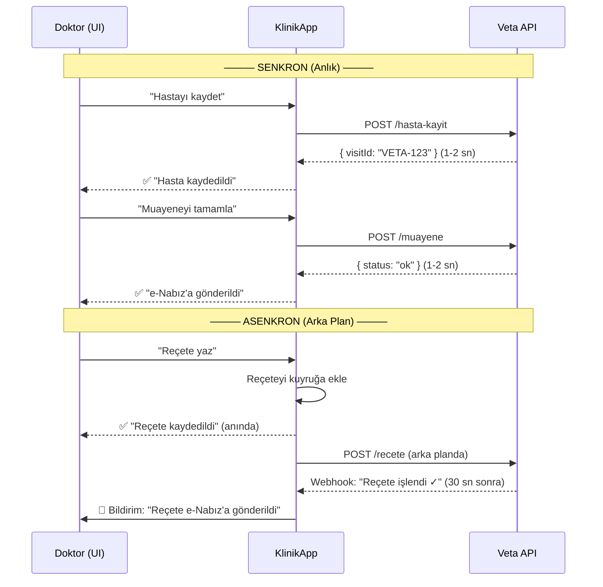

# 📡 Senkron vs Asenkron & Sağlık-NET Veri Paketleri Rehberi

---

## 1. Senkron vs Asenkron — Basit Anlatım

### Senkron = "Telefon Görüşmesi" 📞

```
Sen: "Merhaba, hasta kaydı gönderiyorum"
Veta: (işliyor... 2 saniye... )
Veta: "Tamam, aldım. Referans ID: VETA-123"
Sen: "Teşekkürler, şimdi muayene bilgisini gönderiyorum"
```

**Sen aradığında karşı taraf cevap verene kadar BEKLERSIN.** Cevap gelince devam edersin.

- ✅ Sonucu anında bilirsin (başarılı mı, hatalı mı?)
- ✅ Basit — gönder, bekle, cevabı al
- ❌ Veta'nın API'ı 5 saniye geç cevap verirse → senin arayüzün de 5 saniye donar
- ❌ Veta'nın API'ı çökerse → senin sistemin de takılır

### Asenkron = "WhatsApp Mesajı" 💬

```
Sen: "Hasta kaydını gönderiyorum" ✓✓ (iletildi)
(Sen başka işlere devam edersin)
...
(3 dakika sonra)
Veta: "Kaydını aldım, referans ID: VETA-123" 🔔 (bildirim gelir)
```

**Mesajı atarsın, cevabı beklemezsin.** Cevap geldiğinde sana bildirim gelir (webhook).

- ✅ Arayüzün hiç donmaz — gönder, unut, devam et
- ✅ Veta çökse bile mesajın kuyrukta bekler, düzelince işlenir
- ❌ Sonucu hemen bilemezsin — "acaba gitti mi?" belirsizliği
- ❌ Daha karmaşık — kuyruk sistemi, webhook, hata takibi lazım

---

## 2. Senin Durumun İçin Ne Mantıklı?

Cevap: **Hibrit** (ikisinin karışımı) — ama ağırlıklı olarak **senkron**.

| İşlem | Model | Neden |
|-------|-------|-------|
| 🟢 **101 - Hasta Kayıt** | **Senkron** | Doktor hasta girdiğinde hemen `visitId` lazım, sonraki adımlara geçemezsin |
| 🟢 **103 - Muayene** | **Senkron** | Muayene tamamla butonuna basınca sonucunu görmeli |
| 🟢 **106 - Çıkış** | **Senkron** | Hasta çıkışında "e-Nabız'a gönderildi ✓" onayı görmeli |
| 🟡 **102 - Hizmet/İlaç** | **Asenkron olabilir** | Birden fazla işlem varsa toplu gönderim mantıklı |
| 🟡 **107 - Reçete** | **Asenkron olabilir** | Arka planda gönderilip webhook ile onay alınabilir |

### Pratik Sonuç:



> [!TIP]
> **Veta'ya söyle:** "Kritik işlemlerde (hasta kayıt, muayene, çıkış) **senkron** çalışalım — 2-3 saniye timeout ile. Reçete ve toplu hizmet gibi şeylerde ise **webhook callback** ile asenkron çalışabiliriz."

---

## 3. Sağlık-NET Veri Paketleri — Tam Tablo

Bakanlık'ın Sağlık-NET sistemi üzerinden gönderilen tüm paketler:

| Kod | Paket Adı | Ne Zaman Gönderilir | İçerik | Sana Lazım mı? |
|-----|-----------|---------------------|--------|-----------------|
| **101** | Hasta Kayıt | Hasta kliniğe geldiğinde | TC, Ad/Soyad, Doğum Tarihi, Cinsiyet, Branş | ✅ **Evet** |
| **102** | Hizmet/İlaç/Malzeme | İşlem yapıldığında | SUT işlem kodu, ilaç bilgisi, malzeme, ameliyat | ✅ **Evet** |
| **103** | Muayene | Muayene tamamlandığında | ICD-10 tanı kodu, tedavi, uzman bilgisi | ✅ **Evet** |
| **104** | Fatura | Faturalandırma | Tutar, SGK bilgisi | ⚠️ **Belki** (özel klinik için zorunlu değil) |
| **105** | Laboratuvar Sonuç | Tahlil sonuçlandığında | LOINC kodu, sonuç değeri, referans aralığı | ⚠️ **İleride** (lab entegrasyonu varsa) |
| **106** | Çıkış | Hasta çıkışında | Çıkış durumu, sevk bilgisi, yatış süresi | ✅ **Evet** |
| **107** | Reçete | Reçete yazıldığında | İlaç ATC kodu, doz, kullanım süresi | ✅ **Evet** (klinik reçete yazıyorsa) |
| **108** | Ameliyat | Ameliyat yapıldığında | Ameliyat kodu, ekip, süre | ❌ Hayır (diş kliniği için değil) |

### Senin için öncelik sırası:

```
1. 🟢 101 → Hasta Kayıt (İLK YAPILACAK — her şeyin temeli)
2. 🟢 103 → Muayene (tanı kodu — en çok kullanılacak)
3. 🟢 106 → Çıkış (hasta gidince otomatik)
4. 🟡 102 → Hizmet (yapılan işlemler — dolgu, çekim vb.)
5. 🟡 107 → Reçete (antibiyotik, ağrı kesici vb.)
6. ⚪ 104 → Fatura (özel klinik için opsiyonel)
7. ⚪ 105 → Lab (ileride eklenebilir)
```

---

## 4. SKRS Kodları — Ne Kullanacaksın?

SKRS, Bakanlık'ın "ortak dil"i. Doktor "diş çektim" diyemez — bir **kod** göndermek zorunda. İşte senin kullanacağın kod sistemleri:

### 🏷️ A) ICD-10 — Tanı Kodları (103 Muayene için)

Doktor hastaya ne teşhis koydu?

| Kod | Anlam | Kullanım |
|-----|-------|----------|
| `K02.1` | Dentin çürüğü | Diş çürüğü teşhisi |
| `K04.0` | Pulpitis | Kanal tedavisi gerektiğinde |
| `K05.1` | Kronik gingivitis | Diş eti iltihabı |
| `K08.1` | Kazaya bağlı diş kaybı | Travma sonucu |
| `K08.8` | Diş ve destek dokularda diğer hastalıklar | Genel diş problemi |
| `K12.0` | Aftöz stomatit | Ağız yarası |

> **KlinikApp'e ne lazım:** Doktor muayene kaydederken bir **ICD-10 arama kutusu**. Doktor "çürük" yazınca `K02` kodları listelenir, seçer.

### 🔧 B) SUT İşlem Kodları (102 Hizmet için)

Hastaya ne işlem yapıldı?

| Kod | İşlem | Açıklama |
|-----|-------|----------|
| `401.010` | Diş çekimi (tek diş) | Basit çekim |
| `401.030` | Süt dişi çekimi | Çocuk hastalar |
| `402.010` | Dolgu (tek yüz) | Amalgam/kompozit |
| `402.020` | Dolgu (iki yüz) | Daha geniş dolgu |
| `403.010` | Kanal tedavisi (tek kanal) | Endodonti |
| `404.010` | Diş taşı temizliği | Detertraj |
| `405.010` | Porselen kaplama | Protetik |

> **KlinikApp'e ne lazım:** İşlem kayıt ekranında **SUT kodu seçimi**. Doktor "dolgu yaptım" → `402.010` seçer.

### 💊 C) ATC Kodları (107 Reçete için)

Hastaya hangi ilaç yazıldı?

| Kod | İlaç | Kullanım |
|-----|------|----------|
| `J01CA04` | Amoksisilin | Antibiyotik |
| `N02BE01` | Parasetamol | Ağrı kesici |
| `M01AE01` | İbuprofen | Anti-inflamatuar |
| `A01AB03` | Klorheksidin | Ağız gargarası |

> **KlinikApp'e ne lazım:** Reçete yazarken ilaç arama → ATC kodu otomatik eşleşir.

### 🏥 D) Diğer SKRS Kodları

| Kod Türü | Ne İçin | Örnek |
|----------|---------|-------|
| **Branş Kodu** | Klinik branşı | `2200` = Diş Hekimliği |
| **Cinsiyet Kodu** | Hasta cinsiyeti | `1` = Erkek, `2` = Kadın |
| **Çıkış Durumu** | Hasta nasıl çıktı | `1` = Şifa, `6` = Sevk |
| **Kurum Kodu** | Kliniğin resmi kodu | Bakanlık'tan alınan tesis kodu |

---

## 5. Büyük Tablo: Her Pakette Hangi SKRS Kodu Gidecek?

```
┌─────────────────────────────────────────────────────────────┐
│                    101 - HASTA KAYIT                        │
│  Gönderilecek:                                              │
│  • TC Kimlik (zorunlu)                                      │
│  • Ad / Soyad                                               │
│  • Doğum Tarihi                                             │
│  • Cinsiyet (SKRS: 1/2)                                     │
│  • Branş Kodu (SKRS: 2200)                                  │
│  • Kurum Kodu (Bakanlık tesis kodu)                          │
│  Dönen: SYS Takip No → Veta saklar, sana visitId döner      │
├─────────────────────────────────────────────────────────────┤
│                    103 - MUAYENE                            │
│  Gönderilecek:                                              │
│  • visitId (Veta referansı)                                 │
│  • ICD-10 Tanı Kodu (ör: K02.1)                             │
│  • Tanı tipi (Ana/Ek)                                       │
│  • Doktorun diploması no (veya TC)                          │
├─────────────────────────────────────────────────────────────┤
│                    102 - HİZMET / İLAÇ                     │
│  Gönderilecek:                                              │
│  • visitId                                                  │
│  • SUT İşlem Kodu (ör: 401.010)                             │
│  • İşlem adedi                                              │
│  • Diş numarası (FDI sistemi: 11-48)                        │
│  • Kullanılan malzeme (varsa)                               │
├─────────────────────────────────────────────────────────────┤
│                    107 - REÇETE                             │
│  Gönderilecek:                                              │
│  • visitId                                                  │
│  • İlaç ATC Kodu (ör: J01CA04)                              │
│  • Doz / Kullanım şekli                                     │
│  • Kaç gün kullanılacak                                     │
│  • Kutu adedi                                               │
├─────────────────────────────────────────────────────────────┤
│                    106 - ÇIKIŞ                              │
│  Gönderilecek:                                              │
│  • visitId                                                  │
│  • Çıkış durumu (SKRS: 1=Şifa)                              │
│  • Çıkış tarihi/saati                                       │
│  • Sevk var mı? (opsiyonel)                                 │
└─────────────────────────────────────────────────────────────┘
```

---

## 6. Veta'ya Sorulacak Soru (Güncellenmiş)

Artık paketleri bildiğine göre, Veta'ya şunu sor:

> "Biz 101, 102, 103, 106 ve 107 paketlerini gönderebilmek istiyoruz. Sizin API'ınız bu 5 paketi destekliyor mu? Her biri için ayrı endpoint mi var, yoksa tek bir endpoint'e paket tipi parametresiyle mi gönderiyoruz?"

Bu soru Veta'da profesyonel bir izlenim bırakacaktır 👆
